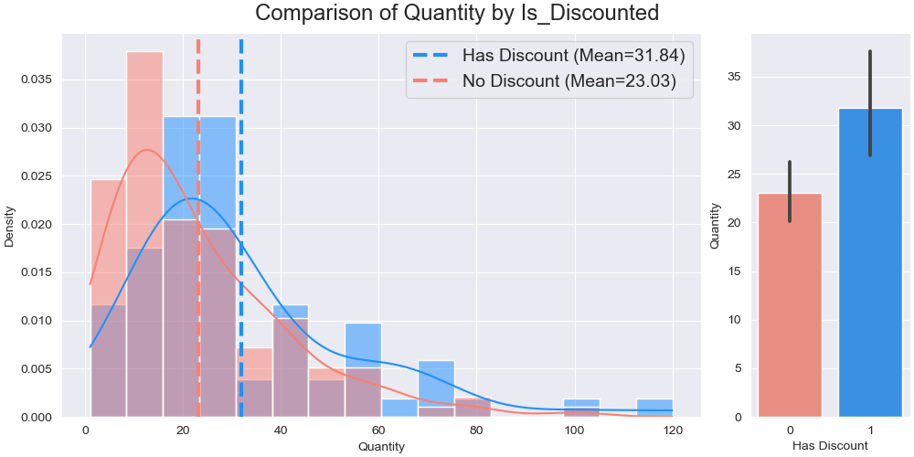

# Discounted Items: Belt-Exam-A

by Israel Diaz

## Task

Your task is to use your data science skills to help Northwind Traders, Inc. process and analyze their internal API data on customer sales. They want you to do 2 things for them. 

1. Convert their internal API results into a MySQL Database and 
2. Formally answer the following question using hypothesis testing: 

    Do discounted products sell in higher quantities than non-discounted products?

They have provided you with a .json found in the data folder.
 
## EDA

It is clear that the means are different

I performed the T-test to determine if this difference is statistically significant.

## Hypothesis Testing

I set the following hypothesis.

Null Hypothesis: **There is no significant difference in the sell quantity between the products with or without discount.**

Alternate Hypothesis: **There is a significant difference in the sell quantities between products with and without discount.**

The Test resulted in this statistical outcome:

* p-value=0.3651829204
* Significant: False

Because the p-value is greater than the alpha value (0.05), then we can **Fail to Reject** the Null Hypothesis of ***There is no significant difference in the sell quantity between the products with or without discount.***

## Summary

Despite we can have some intuitive certainty about the there would be significant difference in the quantity of product that are sold with a sort of discount and those that not, in this case, for this specific data (population), that difference is not significant according to the Test performed in this project.

That is, products with discount are sold the same (statistically speaking) that those that don't have any discount.

That may be clearly seen in the graph above despite the two means are different, both distribution are similar.

